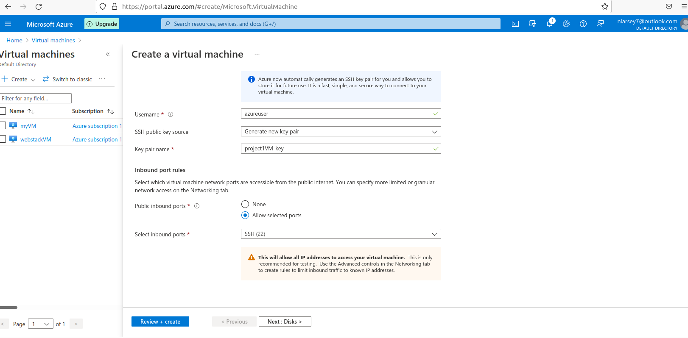
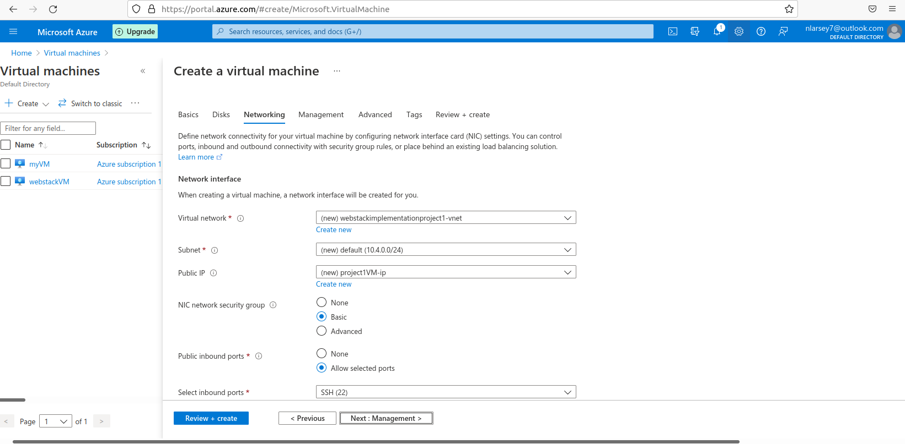
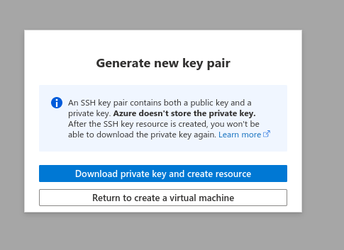
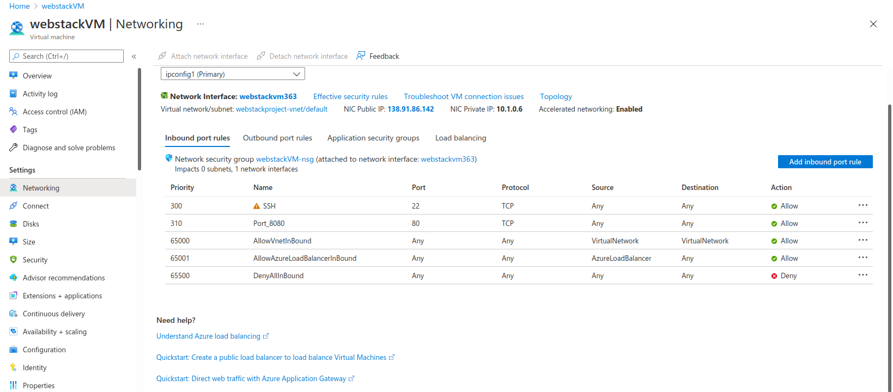
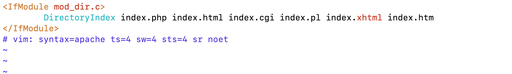

# web-stack-implementation

Howdy ya'll and welcome to my first Web Stack Implementation project!

What is a Web Stack? It is is a group of software components, used to implement or set up various applications (for example, a website). The "stack" refers to the specific layered components (e.g. OS system, webserver, script interpreter, and database) which are built on top of each other. One of the most popular web stacks include LAMP, which stands for Linux, Apache, MySQL, and PHP or Python or Perl. The LAMP stack will be used for this project!

# LINUX

## Setting up your virtual environment

Linux is an operating system (OS) just like Windows, iOS, and Android. It is the best known and most used open source operating system in the world. It is flexible and easy to configure.

In order to complete this project, it is necessary to set up a virtual environment. In order to achieve this, first, create a free [Azure account](https://azure.microsoft.com/en-us/features/azure-portal/) and then create a virtual machine (VM) using the Ubuntu Server OS. More details in the following section!

You may be wondering, 'what is Azure'? Azures is a cloud service provided by Microsoft. One the leading Cloud Service Providers in the world. Azure offers a wide variety of databases and services for different types of applications. This allows users to choose the right tool for the job while receiving the best cost and performance.

Azure offers a Free Trial for newly registered account users. This enables users to try out some Azure services free of charge over certain period. For this project, we will utilize the [Azure VM](https://docs.microsoft.com/en-us/azure/virtual-machines/linux/overview) service, which is covered by the Free Trial version!

**Let's get started!**

Begin by registering and setting up an [Azure account](https://azure.microsoft.com/en-us/features/azure-portal/) and following the directions on the screen. Once you have created your AWS account, navigate to the login page and type in your credentials.

Once you've signed into the Azure portal, we would need to creat and provision a new VM. There are a few ways to go about it. you can use the create a resource (plus sign) or, finding the Virtual using Quick search or clicking home and finding the virtual machine blade. 

In this instance I will click Virtual machines directly from the Azure services page. 

This will take me to the next page to create a new VM. Here, I will click create and select Virtual machine from the dropdown options.

This will take me to the next page where I will need to fill out informations pertaining to the VM I intend to create. 
For the subscription page I will leave it as the default Azure subsription. 
For resource group I will create a new one and name it webstackimplementationproject1
I will name my VM project1VM
For region, I will choose the closest region to me which in this case will be US west
I chose Ubuntu Server 20.04 LTS since that is what we plan on running for this project.
I will leave the size as the defualt and SSH public key.

I will leave the username as the defualt, in this case which azureuser
I will choose Generate new key pair for the SSH public key source
My key pair name will be filled as project1VM_key
Select Allow selected ports for the public inbound ports
Make sure select inbound ports is SSH 22.

Now clicking next will take me the to the Disks page. Since I will not be making any changes in this esction, I will leave all the options to the default.

Now I will click next which will take me to the networking page. Again I will not be making any changes here, therefore all selections will be left as the defualt. 

Next we move the management page but here also I will leave all the defaults selected. 

Because I have no need to make any changes in the Adanced and Tags sections, I will proceed to click the review and create button.  This will take me the review + create page after it has gone through validation and passed. On here we see the products details of the VM we intend to create. Also on this page is the Terms and all the choices selected to create the VM.

After reviewing and making sure everything is how you want it, You will  proceed to click the create button which will begin the proviosioning of the VM.  
Before the VM completes deploying, a generate new key pair window will pop up which you will select Generate and create new key pair. 

A different window will pop asking us to save the generated new key in a .pem file. You will click ok the save the newly generated key pair for use later in this project. 

Finally, you will see a notification telling you the deployment of your VM is complete. 

 

Voila!! alas you have successfully deployed your first VM in the Azure portal. Now you can view your newly created Azure VM by clicking "Go to resources at the bottom-left of your screen.

# Connecting to your VM from your local PC

**PLEASE NOTE** - Anchor tags < > will be used to indicate contents what must be replaced with your unique values. For example, if you have a file named "**keypair123.pem**" you must enter this information within the corresponding anchor tag: < **private-key-name**>

Now let's connect to our VM!

Begin by opening Terminal. Once you have opened Terminal, use the ==cd== command to change into the directory that your key pair is located. This is usually the ~/Downloads directory. If you are having difficulty finding it, you can use the ls command to list the contents of your current directory.

Once you have located the key pair, use the command below to activate the key file (.pem). This command will also change permissions (otherwise you may get the error “Bad Permissions”):

$ sudo chmod 0400 <private-key-name>.pem

When prompted, type the password for your local PC and press Enter on your keyboard.

Next, go back to the Azure console for a moment, and navigate to your running VM . Copy the Public IP address . 

Now that you've copied the Public IP address, go back to Terminal. Connect to the EC2 VM by using the command below:

$ ssh -i <private-key-name>.pem ubuntu@<Public-IP-address>

Next, you will be asked if you want to continue connecting. Type Yes and press Enter on your keyboard.

Nice job! You have successfully connected to your Linux server in the Cloud environment.

# APACHE

**Installing Apache on the virtual environment**

What is Apache? Apache is a widely-used fast, reliable, and secure web server software. A web server acts as a middleman between the website visitor browser and the server.

Now we will install Apache using Ubuntu’s package manager: [‘apt’](https://guide.ubuntu-fr.org/server/apt.html) . Begin by using the $ sudo apt update command to check for any available updates.

Next, run the following command to run the Apache package installation:

$ sudo apt install apache2

Terminal will generate a series of code. 

Once completed, use the following command to verify that Apache2 is running as a servive in our OS:

$ sudo systemctl status apache2

If there is a green dot, then it means it's running just how you want and it should look like the image below:

# Modifying The Firewall

In order to receive traffic to our Web Server, it is imperative to open TCP port 80. This is the default port that web browsers utilize in order to access web pages on the Internet.

When we created the VM on the Azure console,the TCP port 22 was opened by default. This allowed us to access the VM via SSH in Terminal. However, we must add a rule to the security groups of our VM configuration, in order to allow inbound connections through port 80.

Begin by navigating to the networking tab for the newly created VM. Click on "Add inbound port rule to tab to your right and edit the inbound port rule for port 80 .

Under the service, choose HTTP in the dropdown menu and the click add at the bottom left. 

Now let's verify whether or not we can receive traffic. On the Terminal, use the command to send a request the Apache HTTP Server on port 80.

$ curl http://localhost:80

You should see something like this:

Next, let's try to verify access through the web browser using the public IP address of the VM. Open a web browser of your choice and then enter the following url (remember to replace contents within the **Anchor Tabs** < >):

http://<Public-IP-Address>:80

You should see the following web page. This is Apache2 Ubuntu Defualt page:

# MySQL

**Installing MySQL on the virtual environment**

Congratulations on setting up and running your Apache web server. Next, we will install MySQL, which is an open-source relational database management system. This will allow us to store and manage data for the website.

Begin by using the following command to install MySQL:

  $ sudo apt install mysql-server

When prompted, confirm that you want to proceed with the installation by typing Y for "Yes", and then press "Enter" on your Keyboard.

Once the installation is complete, it is best practice to run a security script in order to add more security access to your database system. Use the following command:

   $ sudo mysql_secure_installation

You will be asked to validate password component. Type Y for "Yes".

Next, you must choose the level of your password validation. There are three levels of password validation policy:

Please choose either 0 = LOW, 1 = MEDIUM or 2 = STRONG

**Please Note:**

LOW --- Length >= 8

MEDIUM --- Length >= 8, numeric, mixed case, and special characters

STRONG --- Length >= 8, numeric, mixed case, special characters and dictionary file

Once you are satisfied with your password, enter it then type Y for “Yes” when asked if you want to continue with the password provided.

For the rest of the questions, type Y for "Yes" and press "Enter" on your keyboard at each prompt.

These security measures will remove anonymous users and the test database, disable remote root logins, and then reload these new rules so that the changes will be reflected on the MySQL database.

Your Terminal should look something like this:

Next, you can check whether you can log in to the MySQL console by typing the following command. This command allows you to connect to the MySQL server as the administrative user (root user), which is implied by the use of 'sudo' part of the command:

   $ sudo mysql

This will connect to the MySQL server as the administrative database user root, which is inferred by the use of sudo when running this command. You should see the following output:

To exit the MySQL console, type the following:

  mysql> exit

# PHP

Installing PHP on the virtual enviornment

Congrats on making it this far! We have reached the final component of the LAMP web stack; PHP is general-purpose scripting language which process code so that it can display dynamic content to the end user.

In addition to installing PHP, we must install php-mysql, which is a PHP module that allows PHP to communicate with MySQL-based databases. We must also install libapache2-mod-php to allow Apache to handle PHP files.

We can simultaneously install all three of these packages. Begin by running the following command on Terminal:

 $ sudo apt install php libapache2-mod-php php-mysql

Congrats! The LAMP stack is now completely installed and fully operational.

# Creating a Virtual Host using Apache

Next, we will create a virtual host using Apache. A virtual host allows us to have multiple websites located on a single machine! This will be used to test our setup.

Begin by creating the directory for projectlamp using the following command:

$ sudo mkdir /var/www/projectlamp

Next, assign ownership of the directory using the following command:

$ sudo chown -R $USER:$USER /var/www/projectlamp

Next, we must create and open a new configuration file using vi, which is a text editor. Use the command below to open a blank file:

$ sudo vi /etc/apache2/sites-available/projectlamp.conf

Next, paste in the following configuration by pressing on i on the keyboard to engage the 'insert' mode, then paste the text below:

<VirtualHost *:80> ServerName projectlamp ServerAlias www.projectlamp ServerAdmin webmaster@localhost DocumentRoot /var/www/projectlamp ErrorLog ${APACHE_LOG_DIR}/error.log CustomLog ${APACHE_LOG_DIR}/access.log combined </VirtualHost>

Once you have entered the text, press esc, type :wq, then press "Enter" on your keyboard to write (save) and exit the vi editor.

Next, we will use a series of commands.

To show the new file in the sites-available directory, use the following command. With this Virtua lHost configuration, we are telling Apache to serve projectlamp using /var/www/projectlampl as its web root directory.

$ sudo ls /etc/apache2/sites-available

Next, use the a2ensite command to enable the new virtual host:

$ sudo a2ensite projectlamp

You may want to disable the default website that comes installed with Apache. This is necessary if you are not using a custom domain name, because in this case Apache’s default configuration would overwrite your virtual host.

To disable Apache’s default website use the following command:

$ sudo a2dissite 000-default

To make sure your configuration file doesn’t contain syntax errors, run:

$ sudo apache2ctl configtest

Finally, reload Apache so these changes take effect:

$ sudo systemctl reload apache2

Although our website is now active, the web root /var/www/projectlamp is still empty. Let's create an index.html file in that location so that we will be able to test that the virtual host works properly. Use the command below:

sudo echo 'Hello LAMP from hostname' $(curl -s http://169.254.169.254/latest/meta-data/public-hostname) 'with public IP' $(curl -s http://169.254.169.254/latest/meta-data/public-ipv4) > /var/www/projectlamp/index.html

Now let's test that the website is correctly displaying our content by opening the EC2 Public IP address in your web browser. http://<Public-IP-Address>:80 .

# Enable PHP on the website

Lastly, we must modify the directory index settings, such that the index.html no longer takes precedence over an index.php file. We can achieve this behavior by editing the /etc/apache2/mods-enabled/dir.conf file and then changing the order in which the index.php file is listed within the DirectoryIndex directive. Use the following command:

sudo vim /etc/apache2/mods-enabled/dir.conf

In the vi editor, modify the default text to the following:
DirectoryIndex index.php index.html index.cgi index.pl index.xhtml index.htm : 

Next, after saving and closing the file, you must reload Apache so the changes take effect. Use the following command:

$ sudo systemctl reload apache2

Finally, we will create a PHP script. This will test whether or not PHP is correctly installed and configured on the server. Use the following command to create a new file named index.php inside your custom web root folder:

$ vim /var/www/projectlamp/index.php

This will open a blank file. Add the following text inside of the file:

<?php
phpinfo();

Once you have completed this step, save and close the file.

Refresh the page on your browser, and you will see a page similar to this (note: contents partially redacted for privacy):

Congratulations! You did it! We have completed our LAMP Web Stack Implementation.

Don't forget to terminate your VM  and it's associated components in Azure portal. Also, be sure to remove the file you created as it contains sensitive information using the following command:

$ sudo rm /var/www/projectlamp/index.php

the is the end!

